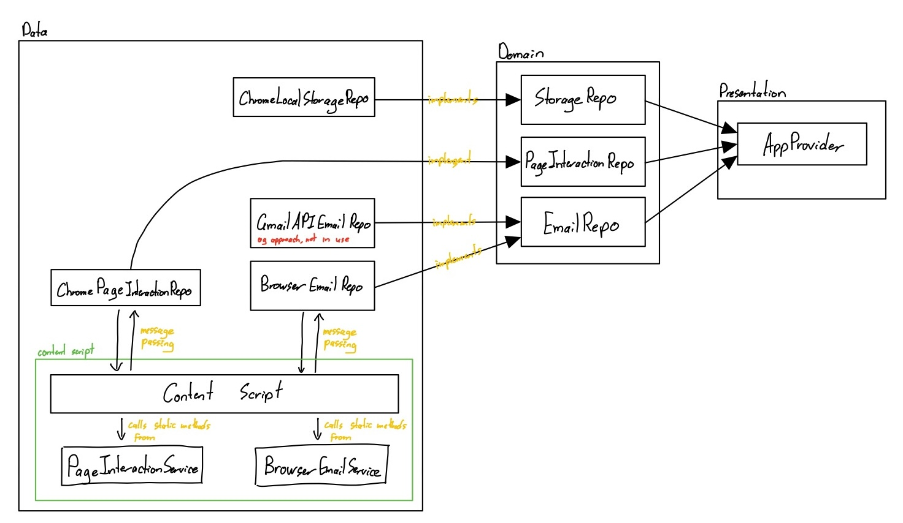

# Contributing to InboxWhiz

Thank you for considering contributing to **InboxWhiz**! ❤️

This document will help you set up a local development environment, understand the project structure, and submit high-quality contributions.

## License Agreement

By submitting a pull request, you agree to license your contributions under the **GNU General Public License v3.0 (GPL-3.0)**, the same license as the project. See the [LICENSE](LICENSE) file for details.

## Project Structure

```
public/               # Contains files that do not need to be pre-bundled
src/
  data/
    content_scripts/  # Connects repositories with services
    repositories/     # Implements browser/email/storage logic outside DOM
    services/         # Implements logic inside DOM
  domain/
    entities/         # Shared models & types
    repositories/     # Interfaces for repositories
  presentation/
    apps/             # UI & entry points
    providers/        # React context providers
test/                 # Automated tests
docs/                 # Documentation
```



---

## Setting Up Locally

### 1. Clone and install

```bash
git clone https://github.com/InboxWhiz/gmail-declutter-extension.git
cd gmail-declutter-extension
npm install
```

### 2. Preview UI

```bash
npm run dev
```

This will run a **local development server with mock implementations of repositories**.

- **If you only want to work on UI**, you can use this local server.
- **If you want to load it into the browser as a proper extension**, follow the next step:

### 3. Load into Chrome

```bash
npm run build
```

This will create a development bundle inside the `dist/` folder.

1. Open `chrome://extensions/` in Chrome.
2. Enable **Developer Mode** (toggle at top right).
3. Click **Load Unpacked** and select the `dist/` folder.

The extension should now appear in your browser.

## Coding Guidelines

### Style

Automated formatting and linting tests will run on all PRs. Run before committing to cut down on GH workflow failures:

```bash
npm run lint
```

## Pull Request Process

1. **Fork the repo** and create your branch from `main`:

   ```bash
   git checkout -b feature/my-awesome-change
   ```

2. **Test locally** to ensure nothing breaks.

   Where appropriate, please write relevant tests to cover your changes. This helps us maintain code quality and prevents future regressions.

   ```bash
   npm run test
   npm run test:ui
   ```

3. **Write a clear PR description**:

   - What feature/fix does this add?
     - reference any existing issues by typing `Fixes #<issue number>` in your pull request
   - Screenshots (if UI changes).

4. **Submit your PR** to `main`.

   - Resolve any merge conflicts.
   - PRs will be reviewed for correctness, clarity, and consistency.
   - Address feedback if requested.

## Need Help?

- Open a GitHub Issue with the `question` label.
- For quick clarifications, leave a comment on the relevant code or PR.
